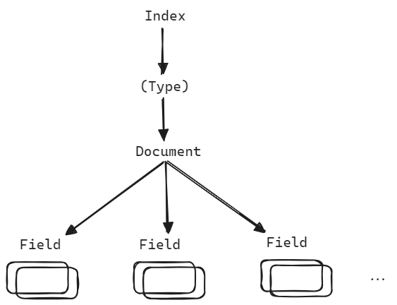

## Elasticsearch 설치, 예제

## ELK 스택 설치

- [github.com/deviantony/docker-elk](https://github.com/deviantony/docker-elk) 을 clone 
- `.env` 파일 내의 주요 패스워드 들 수정
- docker-compose up -d

 

## Elasticsearch

Elasticsearch CRUD 는 REST API 를 활용합니다. 

REST API 로 할 수 있는 작업들은 아래와 같습니다. 

- 클러스터, 노드, 색인(Index)의 상태 또는 통계를 확인 가능합니다.
- 클러스터, 노드, 색인(Index)의 데이터,메타데이터 관리
- CRUD(Create, Read, Update, Delete) 수행
- 인덱스 검색 작업
- 페이징, 정렬, 필터링, 스크립팅, 집계 및 기타 고급작업 

 

## Elasticsearch 구성

도큐먼트

- 단일 데이터 단위를 Document 라고 부릅니다. 
- 데이터가 저장되는 최소단위이며, 하나의 문서는 다수의 필드로 구성됩니다.
- nested 구조를 지원합니다.

인덱스

- Document 의 집합을 인덱스라고 부릅니다.

- ES 에 데이터를 저장하는 것은 인덱싱이라고 부릅니다.
- 인덱스 명으로 문서를 검색합니다.
- 분산환경에서는 인덱스는 여러 노드에 분산되어 저장됩니다.

타입

- 인덱스의 논리적 구조를 의미합니다. 
- 7.0 버전부터 인덱스당 하나의 타입을 제공하며, Index 는 Type 과 동일시 되는 개념이 되었습니다.
- 아마도 7.0 부터는 타입 대신 인덱스라는 단어만 사용할 것으로 보임

필드

- 문서를 구성하는 속성 입니다. 
- Column 과 비슷한 개념입니다. 하나의 필드는 여러 데이터 타입(keyword, text)을 가질 수 있습니다. 

매핑

- 데이터의 저장형태, 검색을 위해 데이터를 어떻게 접근,처리할 지를 의미하는 개념입니다.
- 문서의 필드, 필드의 속성, 인덱싱 방법을 정의합니다.
- 인덱스 매핑에서는 여러 데이터 타입이 지정가능하지만, 필드 명은 중복사용 불가합니다.

 

## 관계형 데이터베이스와 비교

관계형 데이터베이스의 데이터베이스 같은 개념은 일라스틱서치에서는 인덱스를 의미합니다. 관계형 데이터베이스의 테이블과 같은 개념은 일라스틱서치에서는 타입을 의미합니다.

|  Elasticsearch  | 관계형 데이터베이스 |
| :-------------: | :-----------------: |
| 인덱스 (Index)  |    데이터베이스     |
|  샤드 (Shard)   |       파티션        |
|   타입 (Type)   |       테이블        |
| 문서 (Document) |         행          |
|  필드 (Field)   |         열          |
| 매핑 (Mapping)  |       스키마        |
|    QueryDSL     |         SQL         |

 

Elasticsearch 는 검색에 특화된 저장소이며 관계형 데이터베이스와는 목적이 조금 다릅니다. 관계형 데이터베이스는 정규화 등을 통해 데이터의 중복을 제거해 논리적이며 일관적인 데이터의 저장이 목적입니다. 반면 Elasticsearch 의 경우 검색/통계에 특화된 저장소입니다.  

관계형 데이터베이스에서는 SQL로 원하는 정보를 검색하는게 가능하지만, 단순한 검색이지만, Elasticsearch 는 비정형 데이터를 Indexing 을 통해서 검색이 가능하며, 형태소 분석, 역색인을 통해 빠른 검색이 가능합니다. 

## Full Text Search (전문 검색)

텍스트 전체를 색인해서 특정 단어가 포함된 문서를 검색하는 것을 의미하며, Elasticsearch 에서 제공하는 다양한 플러그인을 조합해서 더 빠른 검색이 가능합니다. 

## Inverted Index

역색인을 의미합니다. Inverted Index 를 이용하면 인덱스 내에서 검색을 원하는 단어가 포함된 모든 문서의 위치를 검색 가능합니다. 

Elasticsearch 의 검색이 빠른 이유는 Inverted Index 때문입니다. 관계형 데이터베이스는 모든 문서의 내용을 읽어서 검색하고 있는 키워드가 있는지 검색합니다. 따라서 연산시에 자원소모가 크며 Elasticsearch 에 비해서는 검색에 있어서는 비효율 적입니다.  

Inverted Index 는 특정 Term 을 포함하고 있는 문서에 대한 인덱스 테이블을 만든 것을 의미합니다. Elasticsearch 는 이 인덱스 테이블에서 검색을 하기 때문에 검색 속도가 빠릅니다. 문서가 수천만건이 넘어가더라도 빠르게 검색이 가능합니다. 따라서 '검색'만을 위한 기능에 최적화되어 있습니다. 다만 자주 등장하는 단어 (a, the, and 등)은 오히려 느려질 수 있다는 단점이 있습니다. 

이 경우 Stop Words 설정을 통해 인덱스에서 제거하고 검색어에 등장해도 무시하는 것이 가능합니다. 

이 외에도 삽입/삭제/업데이트 시에 저장소에 오버헤드가 발생합니다. 예를 들면 여행사의 상품인덱스의 경우 상품하나 추가 시에 1시간이 넘게 소요되는 경우도 있다고 전해들은 경험이 있습니다. 

 

## Elasticsearch 의 단점

- Near Real Time (NRT) : 실시간이 아닙니다. 인덱싱된 데이터는 1초 뒤에 검색이 가능합니다.
- 트랜잭션, 롤백 불가 : 리소스 소모가 큰 롤백이나 트랜잭션은 지원하지 않습니다.
- 데이터 업데이트 불가 : 기존 문서를 삭제 후 변경내용으로 새로운 문서를 생성하는 reindexing 방식이기에 비용이 큽니다.

 

## Elasticsearch 클러스터, 노드, 샤드

https://esbook.kimjmin.net/03-cluster/3.2-index-and-shards

- 

## OpenSearch vs AWS Opensearch vs Elasticsearch

https://www.elastic.co/kr/amazon-opensearch-service

### Opensearch

- AWS 에서 Elasticsearch, Kibana 의 ALv2(Apache License 2.0) 오픈소스를 fork 한 것을 Opensearch 라고 명명했습니다.
- Elasticsearch 의 대부분의 기능을 사용 가능합니다.
- 100% 오픈소스이며, 현재는 Opensearch 에서 자체 개발 및 업데이트를 진행합니다.
- https://aws.amazon.com/ko/what-is/opensearch/
- Elasticsearch 7.10 이후의 Elasticsearch 버전은 오픈소스가 아니며, ALV2 라이선스로 배포되지 않아서 Amazon Opensearch Service 는 Elasticsearh 7.10 까지만 지원됩니다.
- Elasticsearch 7.10 이후 부터는 Amazon 에서 관리하는 오픈소스 Opensearch 의 버전으로 기능들을 제공하게 되었습니다.

 

### AWS Opensearch

- AWS Opensearch 는 AWS 에서 제공하는 매니지드 Opensearch 이며, AWS 에서 클러스터 관리를 알아서 해주지만 내장된 플러그인만 사용가능하다는 단점 존재합니다.
- Opensearch 는 es 에 등록되지 않은 플러그인들을 설치할 수 있습니다.
- https://aws.amazon.com/ko/opensearch-service/getting-started/

 

### Elasticsearch

- 2021년 1월 Elastic 은 소프트웨어 라이센스 전략을 변경했는데, Elasticsearch 및 Kibana 의 새 버전을 출시하지 않겠다고 발표했습니다.
- Elasticsearch 7.10 까지만 ALv2 로 오픈소스
- Elasticsearch 7.10 이후의 버전은 유료 서비스
- 설치해서 사용은 가능하지만 추가 기능을 사용하기 위해서는 라이센스 구매가 필수적입니다.

 

## AWS OpenSearch vs OpenSearch

## CRUD Rest API

- CRUD(Create, Read, Update, Delete) 수행

#
