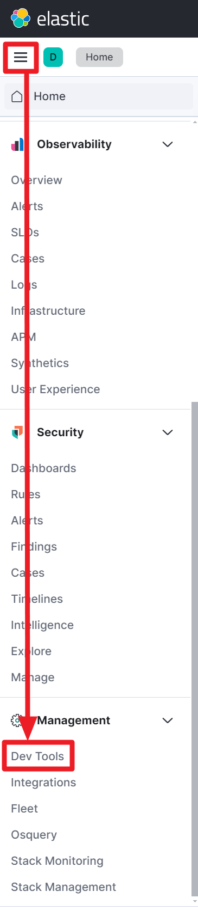

## Aggregation

Elasticsearch 가 처음이라면 아래의 과정을 통해 설치를 해주세요.

 ELK 스택 설치

- [github.com/deviantony/docker-elk](https://github.com/deviantony/docker-elk) 을 clone 
- `.env` 파일 내의 주요 패스워드 들 수정
  - 비밀번호는 8자?이상이어야 에러가 나지 않습니다.

- docker-compose up setup
  - setup-1 exited with code 0 이라는 메시지가 뜨면 정상설치 된 것 입니다.

- docker-compose up -d
- kibana 는 http://localhost:5601 로 접속 가능하며, user, password 는 아래와 같이 입력합니다.
  - user : elastic
  - password : `.env` 파일 내에 입력한 패스워드


<br/>


## 콘솔 접속




<br/>


콘솔은 아래와 같이 사용 가능합니다.<br/>

아래의 코드를 입력합니다. 

```plain
PUT helloworld/_doc/1
{
  "name": "aaa",
  "message": "This is aaa"
}
```

<br/>


그리고 오른쪽 상단의 Run 버튼을 누르거나 Ctrl + Enter 키를 눌러서 명령을 실행합니다.


<br/>


이렇게 하면 index 를 생성해두지 않은 상태라면 새로운 index 가 생성됩니다.<br/>

<br/>


## kibana Sample Data

이번 예제에서는 kibana sample data 를 사용합니다. kibana 콘솔에서는 아래의 메뉴를 통해서 kibana Sample Data 를 사용할 수 있습니다.<br/>

kibana 페이지인 http://localhost:5601 에 접속해서 `Try sample data` 버튼을 클릭해주세요.


<br/>


나타난 페이지에서는 `Other sample data sets` 라는 버튼을 클릭해주세요. 그리고 조금 오래 기다려야 아래와 같은 예제 메뉴들이 나타납니다. 나타난 예제 메뉴 들 중 이번 문서에서는 Sample eCommerce orders 를 사용하기로 결정했습니다.


<br/>


View Data 버튼을 클릭해보면 여러 버튼들이 나타나는데, 원하는 화면들을 모두 들어가서 어떤 기능들이 있는지 확인해봐도 좋습니다.


<br/>


Discover 에는 아래와 같은 화면들이 보여집니다.


<br/>


Dashboard 에는 아래와 같은 화면이 나타납니다.


<br/>

Canvas 에는 아래와 같은 화면들이 나타납니다.


<br/>

Map 에는 아래와 같은 화면들이 나타납니다.


<br/>


## 예제 데이터 확인해보기

이번에는 kibana 콘솔로 진입합니다. (좌측 상단 햄버거 버튼 → Dev Tools 버튼 클릭)<br/>

아래와 같이 `kibana_sample_data_ecommerce` 라는 이름의 인덱스가 추천으로 나타나는 것을 확인할 수 있습니다.<br/>


<br/>


아래의 명령을 수행합니다.

```
GET kibana_sample_data_ecommerce/_search
```

<br/>


출력결과로 굉장히 많은 데이터가 출력됩니다.<br/>

```plain
{
  "took": 1,
  "timed_out": false,
  "_shards": {
    "total": 1,
    "successful": 1,
    "skipped": 0,
    "failed": 0
  },
  "hits": {
    "total": {
      "value": 4675,
      "relation": "eq"
    },
    "max_score": 1,
    
    // ... (생략) ... 내용이 길어서 생략합니다.
    
  }
}
```

<br/>


## Aggregation API

Aggregation API 에는 Metric Aggregation , Bucket Aggregation 과 같은 Aggregation 연산들이 존재합니다.

Metric Aggregation : 주로 산술 연산과 관련된 통계 연산들입니다. Sum,Avg, Min, Max, Cardinality, Percentiles 등과 같은 연산이 있습니다. `keyword` 를 사용하지 않고 숫자값만을 사용해야 합니다.

- sum, avg, min, max, stats : 총합, 평균, 최소, 최대 값을 구하려 할때 사용하는 연산입니다. sum, avg, min, max 를 한꺼번에 구할 때는 stats 를 사용하면 좋습니다.
- cardinality : 유니크한 값이 몇개인지(종류가 몇 개인지 등)을 알아내려 할 때 cardinality 를 사용합니다. keyword, IP 출현횟수 등과 같은 것들을 집계할 때 유용합니다.
- percentiles of, percentiles, percentile\_ranks : 백분위 값을 위한 연산 입니다.

Bucket Aggregation : 조건에 따른 버킷들을 분류해서 생성하고 그룹으로 모읍니다. 버킷 마다 포함되는 도큐먼트의 갯수는 `doc_count` 값으로 표시합니다.

- Range : 숫자 필드와 `from(이상) ~ to(미만)` 를 통해 범위를 지정하고, 이 범위에 해당하는 버킷을 만듭니다.
- Histogram : 인자값으로 전달하는 interval 수치 만큼 버킷을 구분하며, interval 만큼에 해당하는 문서들이 얼마나 존재하는지 확인할 때 사용합니다.
- `date_histogram` , `date_range` : 날짜 간격을 통해서 버킷을 생성해서 통계를 내립니다.
- `terms` : `terms` 필드에 지정한 문자열을 기준으로 버킷을 생성합니다. top, size, order 등을 지정 가능합니다. 
- sub-aggregation : `aggs` 안에 `aggs` 를 하는 것을 의미합니다. 하위 버킷이 늘어나서 점점 깊이가  깊어질 수록 작업량도 늘어나고 메모리 소모량도 커지기에 오류 가능성이 커집니다. 따라서 aggs 를 지나치게 중첩해서 2레벨 이상으로 사용하는 것은 권장되지 않습니다.

<br/>


### Metric Aggregation

주로 산술 연산과 관련된 통계 연산들입니다. Sum,Avg, Min, Max, Cardinality, Percentiles 등과 같은 연산이 있습니다.

#### sum, avg, min, max,stats

e.g.

- `"size": 0,` 을 지정한 이유는  필요없는 `"hits" :[...]` 항목이 너무 많이 나타나서 0으로 지정했습니다.   

```plain
GET kibana_sample_data_ecommerce/_search 
{
  "size": 0,
  "aggs": {
    "sum_base_prices": {
      "sum":{ // (1)
        "field": "products.base_price"
      }
    }
  }
}
```

<br/>


(1) 

- "sum" 연산을 지정해줬고, "field" 항목에 어떤 필드를 기준으로 "sum" 을 할지를 지정해줬습니다.

<br/>


출력결과

```plain
{
  "took": 24,
  "timed_out": false,
  "_shards": {
    "total": 1,
    "successful": 1,
    "skipped": 0,
    "failed": 0
  },
  "hits": {
    "total": {
      "value": 4675,
      "relation": "eq"
    },
    "max_score": null,
    "hits": []
  },
  "aggregations": {
    "sum_of_base_price": {
      "value": 351900.359375
    }
  }
}
```

<br/>


e.g.

- (1) : 남성에 해당하는 직원들의 SUM 연산을 수행합니다.

```python
GET kibana_sample_data_ecommerce/_search 
{
  "query": {
    "match": {
      "customer_gender": "MALE" // (1)
    }
  },
  "size": 0,
  "aggs": {
    "sum_base_prices": {
      "sum":{
        "field": "products.base_price"
      }
    }
  }
}
```

<br/>


e.g.

- (1) : sum, avg, min, max 를 한꺼번에 구할 때는 stats 를 사용하면 좋습니다.

```bash
GET kibana_sample_data_ecommerce/_search 
{
  "query": {
    "match": {
      "customer_gender": "MALE"
    }
  },
  "size": 0,
  "aggs": {
    "sum_base_prices": {
      "stats":{ // (1)
        "field": "products.base_price"
      }
    }
  }
}
```

<br/>


출력결과

```plain
{
  "took": 4,
  "timed_out": false,
  "_shards": {
    "total": 1,
    "successful": 1,
    "skipped": 0,
    "failed": 0
  },
  "hits": {
    "total": {
      "value": 2242,
      "relation": "eq"
    },
    "max_score": null,
    "hits": []
  },
  "aggregations": {
    "sum_base_prices": {
      "count": 4913,
      "min": 6.98828125,
      "max": 1080,
      "avg": 35.01005304803582,
      "sum": 172004.390625
    }
  }
}
```

<br/>


#### cardinality

유니크한 값이 몇개인지(종류가 몇 개인지 등)을 알아내려 할 때 cardinality 를 사용합니다. keyword, IP 출현횟수 등과 같은 것들을 집계할 때 유용합니다.

e.g.

- (1) : cardinality 를 지정해서 keyword 가 몇개 출현하는지를 쿼리하도록 지정했습니다.

```bash
GET kibana_sample_data_ecommerce/_search 
{
  "size": 0,
  "aggs": {
    "categories": {
      "cardinality": { // (1)
        "field": "products.category.keyword"
      }
    }
  }
}
```

<br/>

출력결과

```plain
{
  "took": 3,
  "timed_out": false,
  "_shards": {
    "total": 1,
    "successful": 1,
    "skipped": 0,
    "failed": 0
  },
  "hits": {
    "total": {
      "value": 4675,
      "relation": "eq"
    },
    "max_score": null,
    "hits": []
  },
  "aggregations": {
    "categories": {
      "value": 6
    }
  }
}
```

<br/>


e.g.

- (1) : cardinality 를 지정해줬습니다.

```bash
GET kibana_sample_data_ecommerce/_search 
{
  "size": 0,
  "aggs": {
    "sku_cardinality": {
      "cardinality": { // (1)
        "field": "products.category.keyword"
      }
    }
  }
}
```

<br/>


출력결과

```plain
{
  "took": 6,
  "timed_out": false,
  "_shards": {
    "total": 1,
    "successful": 1,
    "skipped": 0,
    "failed": 0
  },
  "hits": {
    "total": {
      "value": 4675,
      "relation": "eq"
    },
    "max_score": null,
    "hits": []
  },
  "aggregations": {
    "sku_cardinality": {
      "value": 6
    }
  }
}
```


#### percentiles of, percentiles, percentile\_ranks

<br/>


### Bucket Aggregation

#### Range 

#### Histogram

#### `date_histogram` , `date_range`

#### `terms`

#### sub-aggregation

