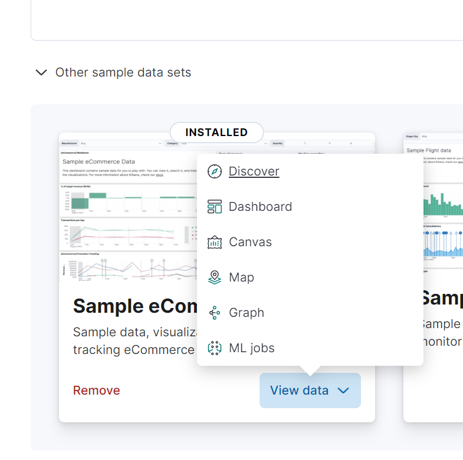
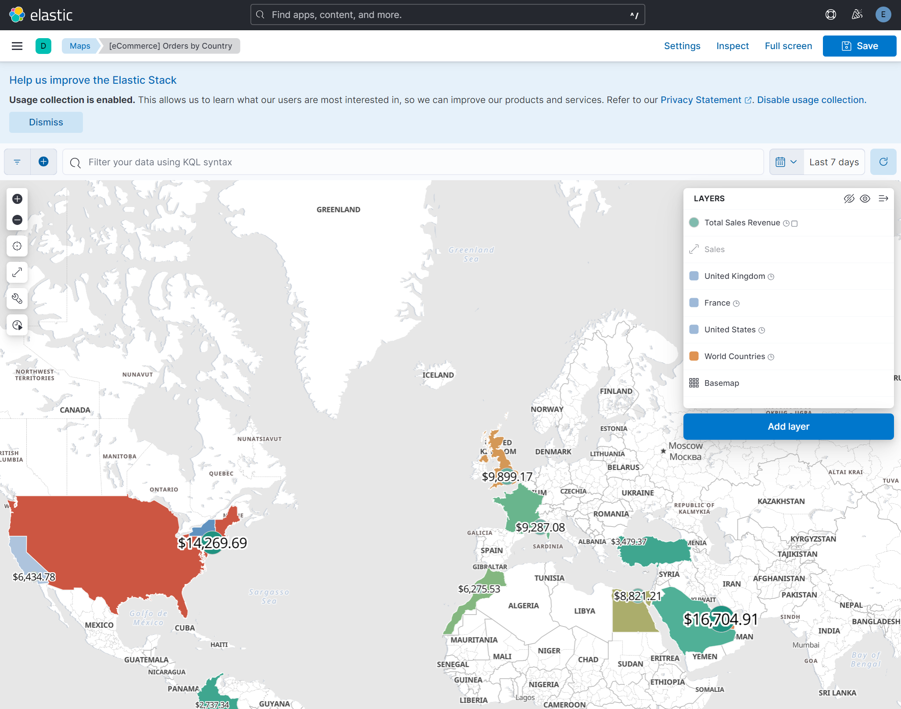

## Aggregation

Elasticsearch 가 처음이라면 아래의 과정을 통해 설치를 해주세요.

 ELK 스택 설치

- [github.com/deviantony/docker-elk](https://github.com/deviantony/docker-elk) 을 clone 
- `.env` 파일 내의 주요 패스워드 들 수정
  - 비밀번호는 8자?이상이어야 에러가 나지 않습니다.

- docker-compose up setup
  - setup-1 exited with code 0 이라는 메시지가 뜨면 정상설치 된 것 입니다.

- docker-compose up -d
- kibana 는 http://localhost:5601 로 접속 가능하며, user, password 는 아래와 같이 입력합니다.
  - user : elastic
  - password : `.env` 파일 내에 입력한 패스워드


<br/>


## 콘솔 접속


<br/>


콘솔은 아래와 같이 사용 가능합니다.<br/>

아래의 코드를 입력합니다. 

```plain
PUT helloworld/_doc/1
{
  "name": "aaa",
  "message": "This is aaa"
}
```

<br/>


그리고 오른쪽 상단의 Run 버튼을 누르거나 Ctrl + Enter 키를 눌러서 명령을 실행합니다.


<br/>


이렇게 하면 index 를 생성해두지 않은 상태라면 새로운 index 가 생성됩니다.<br/>

<br/>


## kibana Sample Data

이번 예제에서는 kibana sample data 를 사용합니다. kibana 콘솔에서는 아래의 메뉴를 통해서 kibana Sample Data 를 사용할 수 있습니다.<br/>

kibana 페이지인 http://localhost:5601 에 접속해서 `Try sample data` 버튼을 클릭해주세요.


<br/>


나타난 페이지에서는 `Other sample data sets` 라는 버튼을 클릭해주세요. 그리고 조금 오래 기다려야 아래와 같은 예제 메뉴들이 나타납니다. 나타난 예제 메뉴 들 중 이번 문서에서는 Sample eCommerce orders 를 사용하기로 결정했습니다.


<br/>


View Data 버튼을 클릭해보면 여러 버튼들이 나타나는데, 원하는 화면들을 모두 들어가서 어떤 기능들이 있는지 확인해봐도 좋습니다.



<br/>


Discover 에는 아래와 같은 화면들이 보여집니다.


<br/>


Dashboard 에는 아래와 같은 화면이 나타납니다.


<br/>

Canvas 에는 아래와 같은 화면들이 나타납니다.


<br/>

Map 에는 아래와 같은 화면들이 나타납니다.



<br/>


## 예제 데이터 확인해보기

이번에는 kibana 콘솔로 진입합니다. (좌측 상단 햄버거 버튼 → Dev Tools 버튼 클릭)<br/>

아래와 같이 `kibana_sample_data_ecommerce` 라는 이름의 인덱스가 추천으로 나타나는 것을 확인할 수 있습니다.<br/>


<br/>


아래의 명령을 수행합니다.

```
GET kibana_sample_data_ecommerce/_search
```

<br/>


출력결과로 굉장히 많은 데이터가 출력됩니다.<br/>

```plain
{
  "took": 1,
  "timed_out": false,
  "_shards": {
    "total": 1,
    "successful": 1,
    "skipped": 0,
    "failed": 0
  },
  "hits": {
    "total": {
      "value": 4675,
      "relation": "eq"
    },
    "max_score": 1,
    
    // ... (생략) ... 내용이 길어서 생략합니다.
    
  }
}
```

<br/>


## Aggregation API

### 요약

Aggregation API 에는 Metric Aggregation , Bucket Aggregation 과 같은 Aggregation 연산들이 존재합니다.

Metric Aggregation : 주로 산술 연산과 관련된 통계 연산들입니다. Sum,Avg, Min, Max, Cardinality, Percentiles 등과 같은 연산이 있습니다. `keyword` 를 사용하지 않고 숫자값만을 사용해야 합니다.

- sum, avg, min, max, stats : 총합, 평균, 최소, 최대 값을 구하려 할때 사용하는 연산입니다. sum, avg, min, max 를 한꺼번에 구할 때는 stats 를 사용하면 좋습니다.
- cardinality : 유니크한 값이 몇개인지(종류가 몇 개인지 등)을 알아내려 할 때 cardinality 를 사용합니다. keyword, IP 출현횟수 등과 같은 것들을 집계할 때 유용합니다.
- percentiles, percentile\_ranks : 백분위 값을 위한 연산 입니다.

Bucket Aggregation : 조건에 따른 버킷들을 분류해서 생성하고 그룹으로 모읍니다. 버킷 마다 포함되는 도큐먼트의 갯수는 `doc_count` 값으로 표시합니다.

- range : 숫자 필드와 `from(이상) ~ to(미만)` 를 통해 범위를 지정하고, 이 범위에 해당하는 버킷을 만듭니다.
- histogram : 인자값으로 전달하는 interval 수치 만큼 버킷을 구분하며, interval 만큼에 해당하는 문서들이 얼마나 존재하는지 확인할 때 사용합니다.
- `date_histogram` , `date_range` : 날짜 간격을 통해서 버킷을 생성해서 통계를 내립니다.
- `terms` : `terms` 필드에 지정한 문자열을 기준으로 버킷을 생성합니다. top, size, order 등을 지정 가능합니다. 
- sub-aggregation : `aggs` 안에 `aggs` 를 하는 것을 의미합니다. 하위 버킷이 늘어나서 점점 깊이가  깊어질 수록 작업량도 늘어나고 메모리 소모량도 커지기에 오류 가능성이 커집니다. 따라서 aggs 를 지나치게 중첩해서 2레벨 이상으로 사용하는 것은 권장되지 않습니다.

<br/>


### Metric Aggregation

주로 산술 연산과 관련된 통계 연산들입니다. Sum,Avg, Min, Max, Cardinality, Percentiles 등과 같은 연산이 있습니다.

#### sum, avg, min, max, stats

e.g.

- `"size": 0,` 을 지정한 이유는  필요없는 `"hits" :[...]` 항목이 너무 많이 나타나서 0으로 지정했습니다.   

```plain
GET kibana_sample_data_ecommerce/_search 
{
  "size": 0,
  "aggs": {
    "sum_base_prices": {
      "sum":{ // (1)
        "field": "products.base_price"
      }
    }
  }
}
```

<br/>


(1) 

- "sum" 연산을 지정해줬고, "field" 항목에 어떤 필드를 기준으로 "sum" 을 할지를 지정해줬습니다.

<br/>


출력결과

```plain
{
  "took": 24,
  "timed_out": false,
  "_shards": {
    "total": 1,
    "successful": 1,
    "skipped": 0,
    "failed": 0
  },
  "hits": {
    "total": {
      "value": 4675,
      "relation": "eq"
    },
    "max_score": null,
    "hits": []
  },
  "aggregations": {
    "sum_of_base_price": {
      "value": 351900.359375
    }
  }
}
```

<br/>


e.g.

- (1) : 남성에 해당하는 직원들의 SUM 연산을 수행합니다.

```python
GET kibana_sample_data_ecommerce/_search 
{
  "query": {
    "match": {
      "customer_gender": "MALE" // (1)
    }
  },
  "size": 0,
  "aggs": {
    "sum_base_prices": {
      "sum":{
        "field": "products.base_price"
      }
    }
  }
}
```

<br/>


e.g.

- (1) : sum, avg, min, max 를 한꺼번에 구할 때는 stats 를 사용하면 좋습니다.

```bash
GET kibana_sample_data_ecommerce/_search 
{
  "query": {
    "match": {
      "customer_gender": "MALE"
    }
  },
  "size": 0,
  "aggs": {
    "sum_base_prices": {
      "stats":{ // (1)
        "field": "products.base_price"
      }
    }
  }
}
```

<br/>


출력결과

```plain
{
  "took": 4,
  "timed_out": false,
  "_shards": {
    "total": 1,
    "successful": 1,
    "skipped": 0,
    "failed": 0
  },
  "hits": {
    "total": {
      "value": 2242,
      "relation": "eq"
    },
    "max_score": null,
    "hits": []
  },
  "aggregations": {
    "sum_base_prices": {
      "count": 4913,
      "min": 6.98828125,
      "max": 1080,
      "avg": 35.01005304803582,
      "sum": 172004.390625
    }
  }
}
```

<br/>


#### cardinality

유니크한 값이 몇개인지(종류가 몇 개인지 등)을 알아내려 할 때 cardinality 를 사용합니다. keyword, IP 출현횟수 등과 같은 것들을 집계할 때 유용합니다.

e.g.

- (1) : cardinality 를 지정해서 keyword 가 몇개 출현하는지를 쿼리하도록 지정했습니다.

```bash
GET kibana_sample_data_ecommerce/_search 
{
  "size": 0,
  "aggs": {
    "categories": {
      "cardinality": { // (1)
        "field": "products.category.keyword"
      }
    }
  }
}
```

<br/>

출력결과

```plain
{
  "took": 3,
  "timed_out": false,
  "_shards": {
    "total": 1,
    "successful": 1,
    "skipped": 0,
    "failed": 0
  },
  "hits": {
    "total": {
      "value": 4675,
      "relation": "eq"
    },
    "max_score": null,
    "hits": []
  },
  "aggregations": {
    "categories": {
      "value": 6
    }
  }
}
```

<br/>


e.g.

- (1) : cardinality 를 지정해줬습니다.

```bash
GET kibana_sample_data_ecommerce/_search 
{
  "size": 0,
  "aggs": {
    "sku_cardinality": {
      "cardinality": { // (1)
        "field": "products.category.keyword"
      }
    }
  }
}
```

<br/>


출력결과

```plain
{
  "took": 6,
  "timed_out": false,
  "_shards": {
    "total": 1,
    "successful": 1,
    "skipped": 0,
    "failed": 0
  },
  "hits": {
    "total": {
      "value": 4675,
      "relation": "eq"
    },
    "max_score": null,
    "hits": []
  },
  "aggregations": {
    "sku_cardinality": {
      "value": 6
    }
  }
}
```

<br/>


#### percentiles, percentile\_ranks

percentiles 연산은 백분위값을 의미하며 백분위 값을 기준으로 순위를 내릴 수도 있고, \[from,  to\] 로 특정 범위 내의 데이터를 구할 수도 있으며, 특정 백분위에 속하는 값을 찾아낼 수도 있습니다.


e.g. percentiles

```python
GET kibana_sample_data_ecommerce/_search 
{
  "size": 0,
  "aggs": {
    "percentiles_prices": {
      "percentiles": {
        "field": "products.price"
      }
    }
  }
}
```

<br/>

출력결과

```plain
{
  "took": 32,
  "timed_out": false,
  "_shards": {
    "total": 1,
    "successful": 1,
    "skipped": 0,
    "failed": 0
  },
  "hits": {
    "total": {
      "value": 4675,
      "relation": "eq"
    },
    "max_score": null,
    "hits": []
  },
  "aggregations": {
    "percentiles_prices": {
      "values": {
        "1.0": 7.98828125,
        "5.0": 10.976366370292887,
        "25.0": 17.563580635112924,
        "50.0": 27.006052606227954,
        "75.0": 45.60907611964553,
        "95.0": 81.14404807144214,
        "99.0": 126.62510880782465
      }
    }
  }
}
```

<br/>

출력결과를 보면 1%, 5%, 25%, 50%, 75%, 95%, 99% 에 해당하는 가격 구간대가 계산되어 있음을 확인 가능합니다.<br/>

percentiles 옵션에 다른 옵션을 주지 않으면 이렇게 결정되는 것으로 보입니다.<br/>

<br/>


e.g. percentile\_ranks

```bash
GET kibana_sample_data_ecommerce/_search 
{
  "size": 0,
  "aggs": {
    "percentiles_prices_from_to": {
      "percentiles": {
        "field": "products.price",
        "percents": [
          10, 20
        ]
      }
    }
  }
}
```

<br/>

출력결과

```plain
{
  "took": 1,
  "timed_out": false,
  "_shards": {
    "total": 1,
    "successful": 1,
    "skipped": 0,
    "failed": 0
  },
  "hits": {
    "total": {
      "value": 4675,
      "relation": "eq"
    },
    "max_score": null,
    "hits": []
  },
  "aggregations": {
    "percentiles_prices_from_to": {
      "values": {
        "10.0": 11.78278168657541,
        "20.0": 15.423417589478415
      }
    }
  }
}
```

<br/>


### Bucket Aggregation

조건에 따른 버킷들을 분류해서 생성하고 그룹으로 모읍니다. 버킷 마다 포함되는 도큐먼트의 갯수는 `doc_count` 값으로 표시합니다. Bucket 연산에는 아래와 같이 Range, Histogram, `date_histogram`, `date_range` , `terms` , `sub-aggregation` 과 같은 연산들이 있습니다.

- Range : 숫자 필드와 `from(이상) ~ to(미만)` 를 통해 범위를 지정하고, 이 범위에 해당하는 버킷을 만듭니다.
- Histogram : 인자값으로 전달하는 interval 수치 만큼 버킷을 구분하며, interval 만큼에 해당하는 문서들이 얼마나 존재하는지 확인할 때 사용합니다.
- `date_histogram` , `date_range` : 날짜 간격을 통해서 버킷을 생성해서 통계를 내립니다.
- `terms` : `terms` 필드에 지정한 문자열을 기준으로 버킷을 생성합니다. top, size, order 등을 지정 가능합니다. 
- sub-aggregation : `aggs` 안에 `aggs` 를 하는 것을 의미합니다. 하위 버킷이 늘어나서 점점 깊이가  깊어질 수록 작업량도 늘어나고 메모리 소모량도 커지기에 오류 가능성이 커집니다. 따라서 aggs 를 지나치게 중첩해서 2레벨 이상으로 사용하는 것은 권장되지 않습니다.

<br/>


#### range 

숫자 필드와 `from(이상) ~ to(미만)` 를 통해 범위를 지정하고, 이 범위에 해당하는 버킷을 만듭니다.

e.g.

- 10 달러 \~ 20 달러 사이에 존재하는 range 연산을 수행해봅니다. 출력결과에서는 `doc_count` 필드에 버킷 별로 포함되는 도큐먼트의 갯수를 표현하게 됩니다.

```bash
GET kibana_sample_data_ecommerce/_search 
{
  "size": 0,
  "aggs": {
    "range_price_result": {
      "range": {
        "field": "products.price",
        "ranges": [
          {
            "from": 10,
            "to": 20
          }
        ]
      }
    }
  }
}
```

<br/>


출력결과

```plain
{
  "took": 5,
  "timed_out": false,
  "_shards": {
    "total": 1,
    "successful": 1,
    "skipped": 0,
    "failed": 0
  },
  "hits": {
    "total": {
      "value": 4675,
      "relation": "eq"
    },
    "max_score": null,
    "hits": []
  },
  "aggregations": {
    "range_price_result": {
      "buckets": [
        {
          "key": "10.0-20.0",
          "from": 10,
          "to": 20,
          "doc_count": 2233
        }
      ]
    }
  }
}
```

<br/>


#### histogram

인자값으로 전달하는 interval 수치 만큼 버킷을 구분하며, interval 만큼에 해당하는 문서들이 얼마나 존재하는지 확인할 때 사용합니다.<br/>

e.g. 100 단위로 product.price 가 얼마나 존재하는지를 검색해봅니다. 

- 약간은 크게 봤을때 가격 분포가 어떻게 되는지 보기 위해 100 단위로 지정했습니다.
- 만약 더 세분화해서 `"interval": 10` 으로 지정해보면 더 세분화된 출현 빈도를 확인할 수 있습니다.

```python
GET kibana_sample_data_ecommerce/_search 
{
  "size": 0,
  "aggs": {
    "histogram_prices": {
      "histogram": {
        "field": "products.price",
        "interval": 100
      }
    }
  }
}
```

<br/>


출력결과

```plain
{
  "took": 2,
  "timed_out": false,
  "_shards": {
    "total": 1,
    "successful": 1,
    "skipped": 0,
    "failed": 0
  },
  "hits": {
    "total": {
      "value": 4675,
      "relation": "eq"
    },
    "max_score": null,
    "hits": []
  },
  "aggregations": {
    "histogram_prices": {
      "buckets": [
        {
          "key": 0,
          "doc_count": 4672
        },
        {
          "key": 100,
          "doc_count": 263
        },
        {
          "key": 200,
          "doc_count": 12
        },
        {
          "key": 300,
          "doc_count": 1
        },
        {
          "key": 400,
          "doc_count": 1
        },
        {
          "key": 500,
          "doc_count": 0
        },
        {
          "key": 600,
          "doc_count": 0
        },
        {
          "key": 700,
          "doc_count": 0
        },
        {
          "key": 800,
          "doc_count": 0
        },
        {
          "key": 900,
          "doc_count": 0
        },
        {
          "key": 1000,
          "doc_count": 1
        }
      ]
    }
  }
}
```

<br/>


#### `date_histogram` , `date_range`

날짜 간격을 통해서 버킷을 생성해서 통계를 내립니다.

##### date\_histogram

e.g.

```python
GET kibana_sample_data_ecommerce/_search 
{
  "size": 0,
  "aggs": {
    "histogram_order_date": {
      "date_histogram": {
        "field": "order_date",
        "fixed_interval": "1d"
      }
    }
  }
}
```

<br/>


출력결과

```plain
{
  "took": 3,
  "timed_out": false,
  "_shards": {
    "total": 1,
    "successful": 1,
    "skipped": 0,
    "failed": 0
  },
  "hits": {
    "total": {
      "value": 4675,
      "relation": "eq"
    },
    "max_score": null,
    "hits": []
  },
  "aggregations": {
    "histogram_order_date": {
      "buckets": [
        {
          "key_as_string": "2024-05-16T00:00:00.000Z",
          "key": 1715817600000,
          "doc_count": 146
        },
        {
          "key_as_string": "2024-05-17T00:00:00.000Z",
          "key": 1715904000000,
          "doc_count": 153
        },
        // ... (생략) ... 
      ]
    }
  }
}
```

<br/>


##### date\_range

e.g.

```python
GET kibana_sample_data_ecommerce/_search 
{
  "size": 0,
  "aggs": {
    "date_range_order_date": {
      "date_range": {
        "field": "order_date",
        "ranges": [
          {
            "from": "2024-05-15",
            "to": "2024-05-23"
          }
        ]
      }
    }
  }
}
```

<br/>

출력결과

```plain
{
  "took": 1,
  "timed_out": false,
  "_shards": {
    "total": 1,
    "successful": 1,
    "skipped": 0,
    "failed": 0
  },
  "hits": {
    "total": {
      "value": 4675,
      "relation": "eq"
    },
    "max_score": null,
    "hits": []
  },
  "aggregations": {
    "date_range_order_date": {
      "buckets": [
        {
          "key": "2024-05-15T00:00:00.000Z-2024-05-23T00:00:00.000Z",
          "from": 1715731200000,
          "from_as_string": "2024-05-15T00:00:00.000Z",
          "to": 1716422400000,
          "to_as_string": "2024-05-23T00:00:00.000Z",
          "doc_count": 1023
        }
      ]
    }
  }
}
```

<br/>


#### `terms`

필드에 지정한 문자열을 기준으로 버킷을 생성합니다. top, size, order 등을 지정 가능합니다. 

e.g.

- `products.manufacturer.keyword` 마다 나타난 doc 의 갯수를 카운팅합니다.

```python
GET kibana_sample_data_ecommerce/_search 
{
  "size": 0,
  "aggs": {
    "manufacturer_count_result":{
      "terms": {
        "field": "products.manufacturer.keyword"
      }
    }
  }
}
```

<br/>

출력결과

```plain
{
  "took": 5,
  "timed_out": false,
  "_shards": {
    "total": 1,
    "successful": 1,
    "skipped": 0,
    "failed": 0
  },
  "hits": {
    "total": {
      "value": 4675,
      "relation": "eq"
    },
    "max_score": null,
    "hits": []
  },
  "aggregations": {
    "manufacturer_count_result": {
      "doc_count_error_upper_bound": 0,
      "sum_other_doc_count": 783,
      "buckets": [
        {
          "key": "Low Tide Media",
          "doc_count": 1553
        },
        {
          "key": "Elitelligence",
          "doc_count": 1370
        },
        {
          "key": "Oceanavigations",
          "doc_count": 1218
        },
        {
          "key": "Tigress Enterprises",
          "doc_count": 1055
        },
        {
          "key": "Pyramidustries",
          "doc_count": 947
        },
        {
          "key": "Angeldale",
          "doc_count": 525
        },
        {
          "key": "Gnomehouse",
          "doc_count": 458
        },
        {
          "key": "Spherecords",
          "doc_count": 415
        },
        {
          "key": "Microlutions",
          "doc_count": 345
        },
        {
          "key": "Spritechnologies",
          "doc_count": 263
        }
      ]
    }
  }
}
```

<br/>


e.g. 이번에는 결과를 줄여서 top N 만큼 가져와봅니다.

- 3건만 가져오기 위해 `"size": 3` 을 지정해줬습니다.
- 내림차순으로 정렬하기 위해 desc, asc 를 지정합니다.

```python
GET kibana_sample_data_ecommerce/_search 
{
  "size": 3,
  "aggs": {
    "brands": {
      "terms": {
        "field": "products.manufacturer.keyword",
        "order": {
          "_count": "desc"
        }
      }
    }
  }
}
```

<br/>

출력결과

- 가장 많이 노출된 `products.manufacturer.keyword` 을 출력합니다. size 를 3 으로 지정했고  keyword 가 가장 많이 나타난 순으로  desc 정렬했습니다.

```plain
{
  "took": 2,
  "timed_out": false,
  "_shards": {
    "total": 1,
    "successful": 1,
    "skipped": 0,
    "failed": 0
  },
  "hits": {
    "total": {
      "value": 4675,
      "relation": "eq"
    },
    "max_score": 1,
    "hits": [
      {
        "_index": "kibana_sample_data_ecommerce",
        "_id": "Vbbo048BRYAsCL4Rbrbk",
        "_score": 1,
        "_source": {
          "category": [
            "Men's Clothing"
          ],
          "currency": "EUR",
          "customer_first_name": "Eddie",
          "customer_full_name": "Eddie Underwood",
          "customer_gender": "MALE",
          "customer_id": 38,
          "customer_last_name": "Underwood",
          "customer_phone": "",
          "day_of_week": "Monday",
          "day_of_week_i": 0,
          "email": "eddie@underwood-family.zzz",
          "manufacturer": [
            "Elitelligence",
            "Oceanavigations"
          ],
          "order_date": "2024-06-10T09:28:48+00:00",
          "order_id": 584677,
          "products": [
            {
              "base_price": 11.99,
              "discount_percentage": 0,
              "quantity": 1,
              "manufacturer": "Elitelligence",
              "tax_amount": 0,
              "product_id": 6283,
              "category": "Men's Clothing",
              "sku": "ZO0549605496",
              "taxless_price": 11.99,
              "unit_discount_amount": 0,
              "min_price": 6.35,
              "_id": "sold_product_584677_6283",
              "discount_amount": 0,
              "created_on": "2016-12-26T09:28:48+00:00",
              "product_name": "Basic T-shirt - dark blue/white",
              "price": 11.99,
              "taxful_price": 11.99,
              "base_unit_price": 11.99
            },
            {
              "base_price": 24.99,
              "discount_percentage": 0,
              "quantity": 1,
              "manufacturer": "Oceanavigations",
              "tax_amount": 0,
              "product_id": 19400,
              "category": "Men's Clothing",
              "sku": "ZO0299602996",
              "taxless_price": 24.99,
              "unit_discount_amount": 0,
              "min_price": 11.75,
              "_id": "sold_product_584677_19400",
              "discount_amount": 0,
              "created_on": "2016-12-26T09:28:48+00:00",
              "product_name": "Sweatshirt - grey multicolor",
              "price": 24.99,
              "taxful_price": 24.99,
              "base_unit_price": 24.99
            }
          ],
          "sku": [
            "ZO0549605496",
            "ZO0299602996"
          ],
          "taxful_total_price": 36.98,
          "taxless_total_price": 36.98,
          "total_quantity": 2,
          "total_unique_products": 2,
          "type": "order",
          "user": "eddie",
          "geoip": {
            "country_iso_code": "EG",
            "location": {
              "lon": 31.3,
              "lat": 30.1
            },
            "region_name": "Cairo Governorate",
            "continent_name": "Africa",
            "city_name": "Cairo"
          },
          "event": {
            "dataset": "sample_ecommerce"
          }
        }
      },
      {
        "_index": "kibana_sample_data_ecommerce",
        "_id": "Vrbo048BRYAsCL4Rbrbk",
        "_score": 1,
        "_source": {
          "category": [
            "Women's Clothing"
          ],
          "currency": "EUR",
          "customer_first_name": "Mary",
          "customer_full_name": "Mary Bailey",
          "customer_gender": "FEMALE",
          "customer_id": 20,
          "customer_last_name": "Bailey",
          "customer_phone": "",
          "day_of_week": "Sunday",
          "day_of_week_i": 6,
          "email": "mary@bailey-family.zzz",
          "manufacturer": [
            "Champion Arts",
            "Pyramidustries"
          ],
          "order_date": "2024-06-09T21:59:02+00:00",
          "order_id": 584021,
          "products": [
            {
              "base_price": 24.99,
              "discount_percentage": 0,
              "quantity": 1,
              "manufacturer": "Champion Arts",
              "tax_amount": 0,
              "product_id": 11238,
              "category": "Women's Clothing",
              "sku": "ZO0489604896",
              "taxless_price": 24.99,
              "unit_discount_amount": 0,
              "min_price": 11.75,
              "_id": "sold_product_584021_11238",
              "discount_amount": 0,
              "created_on": "2016-12-25T21:59:02+00:00",
              "product_name": "Denim dress - black denim",
              "price": 24.99,
              "taxful_price": 24.99,
              "base_unit_price": 24.99
            },
            {
              "base_price": 28.99,
              "discount_percentage": 0,
              "quantity": 1,
              "manufacturer": "Pyramidustries",
              "tax_amount": 0,
              "product_id": 20149,
              "category": "Women's Clothing",
              "sku": "ZO0185501855",
              "taxless_price": 28.99,
              "unit_discount_amount": 0,
              "min_price": 15.65,
              "_id": "sold_product_584021_20149",
              "discount_amount": 0,
              "created_on": "2016-12-25T21:59:02+00:00",
              "product_name": "Shorts - black",
              "price": 28.99,
              "taxful_price": 28.99,
              "base_unit_price": 28.99
            }
          ],
          "sku": [
            "ZO0489604896",
            "ZO0185501855"
          ],
          "taxful_total_price": 53.98,
          "taxless_total_price": 53.98,
          "total_quantity": 2,
          "total_unique_products": 2,
          "type": "order",
          "user": "mary",
          "geoip": {
            "country_iso_code": "AE",
            "location": {
              "lon": 55.3,
              "lat": 25.3
            },
            "region_name": "Dubai",
            "continent_name": "Asia",
            "city_name": "Dubai"
          },
          "event": {
            "dataset": "sample_ecommerce"
          }
        }
      },
      {
        "_index": "kibana_sample_data_ecommerce",
        "_id": "V7bo048BRYAsCL4Rbrbk",
        "_score": 1,
        "_source": {
          "category": [
            "Women's Shoes",
            "Women's Clothing"
          ],
          "currency": "EUR",
          "customer_first_name": "Gwen",
          "customer_full_name": "Gwen Butler",
          "customer_gender": "FEMALE",
          "customer_id": 26,
          "customer_last_name": "Butler",
          "customer_phone": "",
          "day_of_week": "Sunday",
          "day_of_week_i": 6,
          "email": "gwen@butler-family.zzz",
          "manufacturer": [
            "Low Tide Media",
            "Oceanavigations"
          ],
          "order_date": "2024-06-09T22:32:10+00:00",
          "order_id": 584058,
          "products": [
            {
              "base_price": 99.99,
              "discount_percentage": 0,
              "quantity": 1,
              "manufacturer": "Low Tide Media",
              "tax_amount": 0,
              "product_id": 22794,
              "category": "Women's Shoes",
              "sku": "ZO0374603746",
              "taxless_price": 99.99,
              "unit_discount_amount": 0,
              "min_price": 46.01,
              "_id": "sold_product_584058_22794",
              "discount_amount": 0,
              "created_on": "2016-12-25T22:32:10+00:00",
              "product_name": "Boots - Midnight Blue",
              "price": 99.99,
              "taxful_price": 99.99,
              "base_unit_price": 99.99
            },
            {
              "base_price": 99.99,
              "discount_percentage": 0,
              "quantity": 1,
              "manufacturer": "Oceanavigations",
              "tax_amount": 0,
              "product_id": 23386,
              "category": "Women's Clothing",
              "sku": "ZO0272202722",
              "taxless_price": 99.99,
              "unit_discount_amount": 0,
              "min_price": 53.99,
              "_id": "sold_product_584058_23386",
              "discount_amount": 0,
              "created_on": "2016-12-25T22:32:10+00:00",
              "product_name": "Short coat - white/black",
              "price": 99.99,
              "taxful_price": 99.99,
              "base_unit_price": 99.99
            }
          ],
          "sku": [
            "ZO0374603746",
            "ZO0272202722"
          ],
          "taxful_total_price": 199.98,
          "taxless_total_price": 199.98,
          "total_quantity": 2,
          "total_unique_products": 2,
          "type": "order",
          "user": "gwen",
          "geoip": {
            "country_iso_code": "US",
            "location": {
              "lon": -118.2,
              "lat": 34.1
            },
            "region_name": "California",
            "continent_name": "North America",
            "city_name": "Los Angeles"
          },
          "event": {
            "dataset": "sample_ecommerce"
          }
        }
      }
    ]
  },
  "aggregations": {
    "brands": {
      "doc_count_error_upper_bound": 0,
      "sum_other_doc_count": 783,
      "buckets": [
        {
          "key": "Low Tide Media",
          "doc_count": 1553
        },
        {
          "key": "Elitelligence",
          "doc_count": 1370
        },
        {
          "key": "Oceanavigations",
          "doc_count": 1218
        },
        {
          "key": "Tigress Enterprises",
          "doc_count": 1055
        },
        {
          "key": "Pyramidustries",
          "doc_count": 947
        },
        {
          "key": "Angeldale",
          "doc_count": 525
        },
        {
          "key": "Gnomehouse",
          "doc_count": 458
        },
        {
          "key": "Spherecords",
          "doc_count": 415
        },
        {
          "key": "Microlutions",
          "doc_count": 345
        },
        {
          "key": "Spritechnologies",
          "doc_count": 263
        }
      ]
    }
  }
}
```


#### sub-aggregation

`aggs` 안에 `aggs` 를 하는 것을 의미합니다. 하위 버킷이 늘어나서 점점 깊이가  깊어질 수록 작업량도 늘어나고 메모리 소모량도 커지기에 오류 가능성이 커집니다. 따라서 aggs 를 지나치게 중첩해서 2레벨 이상으로 사용하는 것은 권장되지 않습니다.

e.g.

```python
GET kibana_sample_data_ecommerce/_search 
{
  "size": 3,
  "aggs": {
    "manufacturer_count": {
      "terms": {
        "field": "products.manufacturer.keyword"
      },
      "aggs": {
        "sum_manufacturer_prices_result":{
          "sum": {
            "field": "products.price"
          }
        }
      }
    }
  }
}
```

<br/>


출력결과

```plain
{
  "took": 4,
  "timed_out": false,
  "_shards": {
    "total": 1,
    "successful": 1,
    "skipped": 0,
    "failed": 0
  },
  "hits": {
    "total": {
      "value": 4675,
      "relation": "eq"
    },
    "max_score": 1,
    "hits": [
      {
        "_index": "kibana_sample_data_ecommerce",
        "_id": "Vbbo048BRYAsCL4Rbrbk",
        "_score": 1,
        "_source": {
          "category": [
            "Men's Clothing"
          ],
          "currency": "EUR",
          "customer_first_name": "Eddie",
          "customer_full_name": "Eddie Underwood",
          "customer_gender": "MALE",
          "customer_id": 38,
          "customer_last_name": "Underwood",
          "customer_phone": "",
          "day_of_week": "Monday",
          "day_of_week_i": 0,
          "email": "eddie@underwood-family.zzz",
          "manufacturer": [
            "Elitelligence",
            "Oceanavigations"
          ],
          "order_date": "2024-06-10T09:28:48+00:00",
          "order_id": 584677,
          "products": [
            {
              "base_price": 11.99,
              "discount_percentage": 0,
              "quantity": 1,
              "manufacturer": "Elitelligence",
              "tax_amount": 0,
              "product_id": 6283,
              "category": "Men's Clothing",
              "sku": "ZO0549605496",
              "taxless_price": 11.99,
              "unit_discount_amount": 0,
              "min_price": 6.35,
              "_id": "sold_product_584677_6283",
              "discount_amount": 0,
              "created_on": "2016-12-26T09:28:48+00:00",
              "product_name": "Basic T-shirt - dark blue/white",
              "price": 11.99,
              "taxful_price": 11.99,
              "base_unit_price": 11.99
            },
            {
              "base_price": 24.99,
              "discount_percentage": 0,
              "quantity": 1,
              "manufacturer": "Oceanavigations",
              "tax_amount": 0,
              "product_id": 19400,
              "category": "Men's Clothing",
              "sku": "ZO0299602996",
              "taxless_price": 24.99,
              "unit_discount_amount": 0,
              "min_price": 11.75,
              "_id": "sold_product_584677_19400",
              "discount_amount": 0,
              "created_on": "2016-12-26T09:28:48+00:00",
              "product_name": "Sweatshirt - grey multicolor",
              "price": 24.99,
              "taxful_price": 24.99,
              "base_unit_price": 24.99
            }
          ],
          "sku": [
            "ZO0549605496",
            "ZO0299602996"
          ],
          "taxful_total_price": 36.98,
          "taxless_total_price": 36.98,
          "total_quantity": 2,
          "total_unique_products": 2,
          "type": "order",
          "user": "eddie",
          "geoip": {
            "country_iso_code": "EG",
            "location": {
              "lon": 31.3,
              "lat": 30.1
            },
            "region_name": "Cairo Governorate",
            "continent_name": "Africa",
            "city_name": "Cairo"
          },
          "event": {
            "dataset": "sample_ecommerce"
          }
        }
      },
      {
        "_index": "kibana_sample_data_ecommerce",
        "_id": "Vrbo048BRYAsCL4Rbrbk",
        "_score": 1,
        "_source": {
          "category": [
            "Women's Clothing"
          ],
          "currency": "EUR",
          "customer_first_name": "Mary",
          "customer_full_name": "Mary Bailey",
          "customer_gender": "FEMALE",
          "customer_id": 20,
          "customer_last_name": "Bailey",
          "customer_phone": "",
          "day_of_week": "Sunday",
          "day_of_week_i": 6,
          "email": "mary@bailey-family.zzz",
          "manufacturer": [
            "Champion Arts",
            "Pyramidustries"
          ],
          "order_date": "2024-06-09T21:59:02+00:00",
          "order_id": 584021,
          "products": [
            {
              "base_price": 24.99,
              "discount_percentage": 0,
              "quantity": 1,
              "manufacturer": "Champion Arts",
              "tax_amount": 0,
              "product_id": 11238,
              "category": "Women's Clothing",
              "sku": "ZO0489604896",
              "taxless_price": 24.99,
              "unit_discount_amount": 0,
              "min_price": 11.75,
              "_id": "sold_product_584021_11238",
              "discount_amount": 0,
              "created_on": "2016-12-25T21:59:02+00:00",
              "product_name": "Denim dress - black denim",
              "price": 24.99,
              "taxful_price": 24.99,
              "base_unit_price": 24.99
            },
            {
              "base_price": 28.99,
              "discount_percentage": 0,
              "quantity": 1,
              "manufacturer": "Pyramidustries",
              "tax_amount": 0,
              "product_id": 20149,
              "category": "Women's Clothing",
              "sku": "ZO0185501855",
              "taxless_price": 28.99,
              "unit_discount_amount": 0,
              "min_price": 15.65,
              "_id": "sold_product_584021_20149",
              "discount_amount": 0,
              "created_on": "2016-12-25T21:59:02+00:00",
              "product_name": "Shorts - black",
              "price": 28.99,
              "taxful_price": 28.99,
              "base_unit_price": 28.99
            }
          ],
          "sku": [
            "ZO0489604896",
            "ZO0185501855"
          ],
          "taxful_total_price": 53.98,
          "taxless_total_price": 53.98,
          "total_quantity": 2,
          "total_unique_products": 2,
          "type": "order",
          "user": "mary",
          "geoip": {
            "country_iso_code": "AE",
            "location": {
              "lon": 55.3,
              "lat": 25.3
            },
            "region_name": "Dubai",
            "continent_name": "Asia",
            "city_name": "Dubai"
          },
          "event": {
            "dataset": "sample_ecommerce"
          }
        }
      },
      {
        "_index": "kibana_sample_data_ecommerce",
        "_id": "V7bo048BRYAsCL4Rbrbk",
        "_score": 1,
        "_source": {
          "category": [
            "Women's Shoes",
            "Women's Clothing"
          ],
          "currency": "EUR",
          "customer_first_name": "Gwen",
          "customer_full_name": "Gwen Butler",
          "customer_gender": "FEMALE",
          "customer_id": 26,
          "customer_last_name": "Butler",
          "customer_phone": "",
          "day_of_week": "Sunday",
          "day_of_week_i": 6,
          "email": "gwen@butler-family.zzz",
          "manufacturer": [
            "Low Tide Media",
            "Oceanavigations"
          ],
          "order_date": "2024-06-09T22:32:10+00:00",
          "order_id": 584058,
          "products": [
            {
              "base_price": 99.99,
              "discount_percentage": 0,
              "quantity": 1,
              "manufacturer": "Low Tide Media",
              "tax_amount": 0,
              "product_id": 22794,
              "category": "Women's Shoes",
              "sku": "ZO0374603746",
              "taxless_price": 99.99,
              "unit_discount_amount": 0,
              "min_price": 46.01,
              "_id": "sold_product_584058_22794",
              "discount_amount": 0,
              "created_on": "2016-12-25T22:32:10+00:00",
              "product_name": "Boots - Midnight Blue",
              "price": 99.99,
              "taxful_price": 99.99,
              "base_unit_price": 99.99
            },
            {
              "base_price": 99.99,
              "discount_percentage": 0,
              "quantity": 1,
              "manufacturer": "Oceanavigations",
              "tax_amount": 0,
              "product_id": 23386,
              "category": "Women's Clothing",
              "sku": "ZO0272202722",
              "taxless_price": 99.99,
              "unit_discount_amount": 0,
              "min_price": 53.99,
              "_id": "sold_product_584058_23386",
              "discount_amount": 0,
              "created_on": "2016-12-25T22:32:10+00:00",
              "product_name": "Short coat - white/black",
              "price": 99.99,
              "taxful_price": 99.99,
              "base_unit_price": 99.99
            }
          ],
          "sku": [
            "ZO0374603746",
            "ZO0272202722"
          ],
          "taxful_total_price": 199.98,
          "taxless_total_price": 199.98,
          "total_quantity": 2,
          "total_unique_products": 2,
          "type": "order",
          "user": "gwen",
          "geoip": {
            "country_iso_code": "US",
            "location": {
              "lon": -118.2,
              "lat": 34.1
            },
            "region_name": "California",
            "continent_name": "North America",
            "city_name": "Los Angeles"
          },
          "event": {
            "dataset": "sample_ecommerce"
          }
        }
      }
    ]
  },
  "aggregations": {
    "manufacturer_count": {
      "doc_count_error_upper_bound": 0,
      "sum_other_doc_count": 783,
      "buckets": [
        {
          "key": "Low Tide Media",
          "doc_count": 1553,
          "sum_manufacturer_prices_result": { // 여기에 결과가 표시되었습니다.
            "value": 131079.02734375
          }
        },
        // ... (생략) ... 
      ]
    }
  }
}
```


