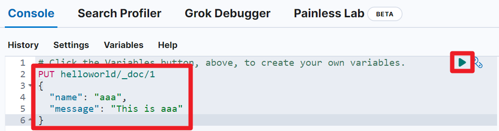

## Document API

## ELK 스택 설치

- [github.com/deviantony/docker-elk](https://github.com/deviantony/docker-elk) 을 clone 
- `.env` 파일 내의 주요 패스워드 들 수정
  - 비밀번호는 8자?이상이어야 에러가 나지 않습니다.

- docker-compose up setup
  - setup-1 exited with code 0 이라는 메시지가 뜨면 정상설치 된 것 입니다.

- docker-compose up -d
- kibana 는 http://localhost:5601 로 접속 가능하며, user, password 는 아래와 같이 입력합니다.
  - user : elastic
  - password : `.env` 파일 내에 입력한 패스워드


<br/>


## 콘솔 접속


<br/>


콘솔은 아래와 같이 사용 가능합니다.<br/>

아래의 코드를 입력합니다. 

```plain
PUT helloworld/_doc/1
{
  "name": "aaa",
  "message": "This is aaa"
}
```

<br/>


그리고 오른쪽 상단의 Run 버튼을 누르거나 Ctrl + Enter 키를 눌러서 명령을 실행합니다.



<br/>


이렇게 하면 index 를 생성해두지 않은 상태라면 새로운 index 가 생성됩니다.<br/>

<br/>


## PUT

먼저 인덱스가 아무것도 생성되지 않은 상태에서 아래의 명령을 수행합니다.

```plain
PUT logs_index/_doc/1
{
  "message": "PAYMENT_FAILURE",
  "reason": "NETWORK_ERROR",
  "occured_service": "abc-comics-payment-api"
}
```

이렇게 하면 `logs_index` 라는 이름의 인덱스가 새로 생성되면서 데이터가 입력됩니다.

<br/>


이번에는 아래의 명령을 수행합니다. 새로운 도큐먼트를 한 건 더 insert 하는 명령입니다.

```plain
PUT logs_index/_doc/2
{
  "message": "PAYMENT_SUCCESS",
  "reason": "SUCCESS",
  "occured_service": "abc-comics-payment-api"
}
```

실행시켜 보면 `logs_index` 라는 이름의 인덱스에 데이터가 insert 되었음을 결과화면에서 확인 가능합니다.

<br/>


## GET

처음에 insert 했던 데이터를 조회해봅니다.

```plain
GET logs_index/_doc/1
```

<br/>

출력결과는 아래와 같습니다.

```plain
{
  "_index": "logs_index",
  "_id": "1",
  "_version": 1,
  "_seq_no": 0,
  "_primary_term": 1,
  "found": true,
  "_source": {
    "message": "PAYMENT_FAILURE",
    "reason": "NETWORK_ERROR",
    "occured_service": "abc-comics-payment-api"
  }
}
```

<br/>


두번째 insert 했던 데이터도 존재하는지 확인해봅니다.

```plain
GET logs_index/_doc/2
```

<br/>

출력결과는 아래와 같습니다.

```plain
{
  "_index": "logs_index",
  "_id": "2",
  "_version": 1,
  "_seq_no": 1,
  "_primary_term": 1,
  "found": true,
  "_source": {
    "message": "PAYMENT_SUCCESS",
    "reason": "SUCCESS",
    "occured_service": "abc-comics-payment-api"
  }
}
```

<br/>


## DELETE

이번에는 도큐먼트를 선택해서 삭제해봅니다. 두번째로 insert 했던 데이터를 삭제합니다.

```plain
DELETE logs_index/_doc/2
```

<br/>


출력결과는 아래와 같습니다.

```plain
{
  "_index": "logs_index",
  "_id": "2",
  "_version": 2,
  "result": "deleted",
  "_shards": {
    "total": 2,
    "successful": 1,
    "failed": 0
  },
  "_seq_no": 2,
  "_primary_term": 1
}
```

<br/>


## POST

데이터 입력을 하는 연산입니다. PUT의 경우에는 Document id 를 입력해줘야 했습니다. POST 의 경우 Document Id 를 입력하지 않아도 됩니다.<br/>

```bash
POST logs_index/_doc
{
  "message": "PAYMENT_SUCCESS",
  "occured_service": "abc-comics-payment-api"
}
```

<br/>


출력결과는 아래와 같습니다.

```plain
{
  "_index": "logs_index",
  "_id": "VLZ8048BRYAsCL4RpbbY", # 여기 
  "_version": 1,
  "result": "created",
  "_shards": {
    "total": 2,
    "successful": 1,
    "failed": 0
  },
  "_seq_no": 3,
  "_primary_term": 1
}
```

자세히 확인해보면 `_id` 항목에 대해 `VLZ8048BRYAsCL4RpbbY` 라는 값이 할당되었음을 확인 가능합니다.<br/>

<br/>


## UPDATE

도큐먼트를 수정하고자 할때 UPDATE 연산을 사용합니다. UPDATE 연산은 원하는 필드만 수정하는 것이 가능합니다.

```plain
POST logs_index/_update/1
{
  "doc": {
    "message": "PG_API_NETWORK_ERROR"
  }
}
```

<br/>

출력결과

```plain
{
  "_index": "logs_index",
  "_id": "1",
  "_version": 2,
  "result": "updated",
  "_shards": {
    "total": 2,
    "successful": 1,
    "failed": 0
  },
  "_seq_no": 4,
  "_primary_term": 1
}
```

<br/>


## Bulk API 

Bulk API 를 이용하면 한번의 연산으로 여러 문서를 한번에 indexing 하거나 삭제하는 것이 가능합니다. 대량 색인이 필요할 때 사용하면 됩니다.

`_id` 가 5, 6 인 데이터를 Bulk api 를 통해 indexing 합니다.

```plain
POST _bulk
{ "index": {"_index": "logs_index", "_id": "5"} }
{ "field": "안녕하세요 (1) 번 이에요" }
{ "index": {"_index": "logs_index", "_id": "6"} }
{ "field": "안녕하세요 (2) 번 이에요" }
```

<br/>


이번에는 delete 와 create 연산을 함께 수행합니다.

- \_id = 5 인 도큐먼트는 삭제
- \_id = 7 인 도큐먼트 생성

```plain
POST _bulk
{ "delete": {"_index": "logs_index", "_id": "5"} }
{ "create": {"_index": "logs_index", "_id": "7"} }
{ "field": "안녕하세요 (3) 번 이에요" }
```

<br/>


이번에는 update 연산을 수행합니다.

```plain
POST _bulk
{ "update": {"_index": "logs_index", "_id": "6"} }
{ "doc": {"field": "(5) 번 이에요"} }
```

<br/>


