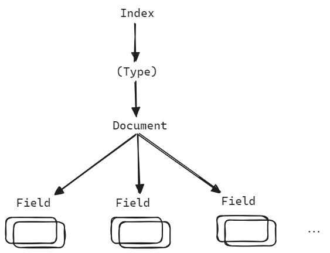
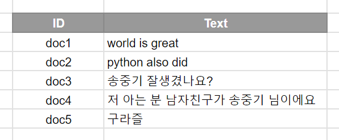
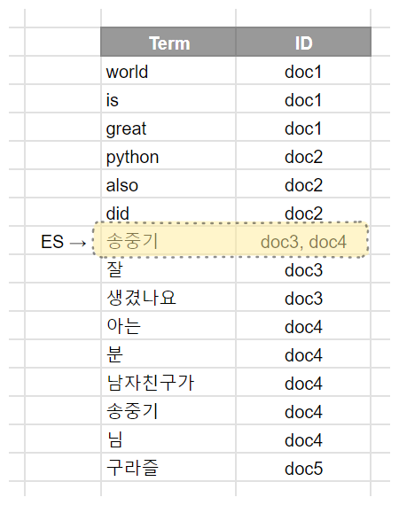
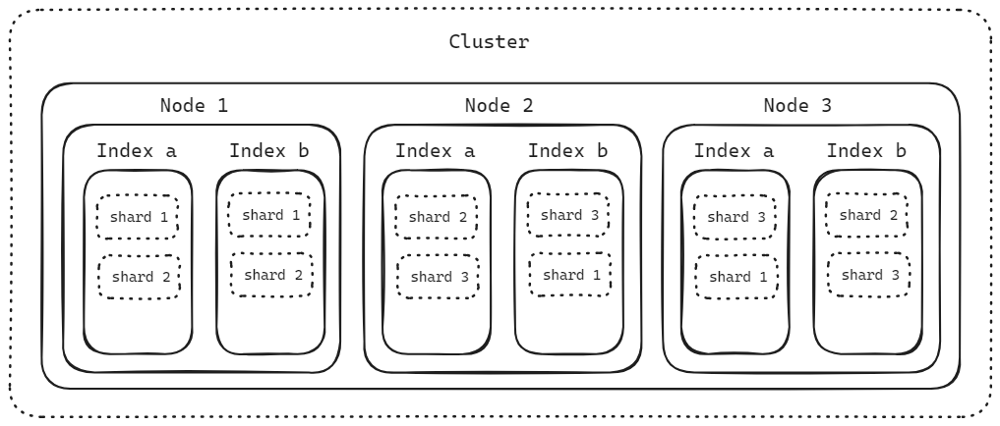
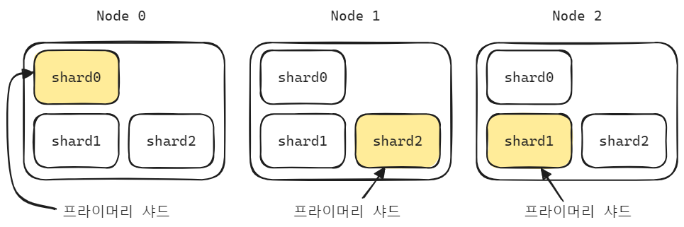
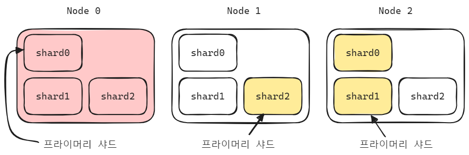
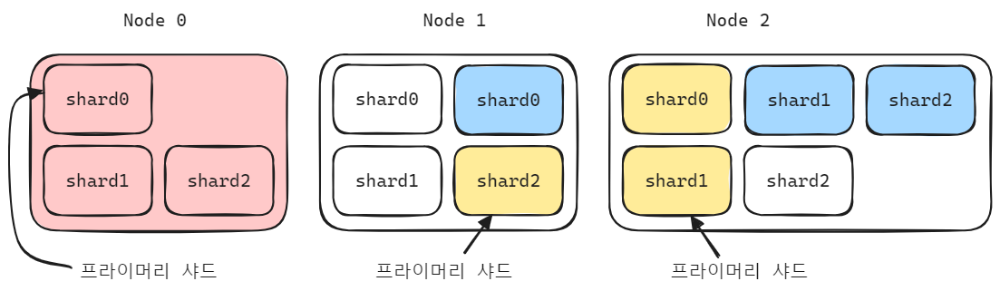

## Elasticsearch 설치, 예제

## ELK 스택 설치

- [github.com/deviantony/docker-elk](https://github.com/deviantony/docker-elk) 을 clone 
- `.env` 파일 내의 주요 패스워드 들 수정
- docker-compose up -d

 

## Elasticsearch

Elasticsearch CRUD 는 REST API 를 활용합니다. 

REST API 로 할 수 있는 작업들은 아래와 같습니다. 

- 클러스터, 노드, 색인(Index)의 상태 또는 통계를 확인 가능합니다.
- 클러스터, 노드, 색인(Index)의 데이터,메타데이터 관리
- CRUD(Create, Read, Update, Delete) 수행
- 인덱스 검색 작업
- 페이징, 정렬, 필터링, 스크립팅, 집계 및 기타 고급작업 

 

## Elasticsearch 구성

도큐먼트

- 단일 데이터 단위를 Document 라고 부릅니다. 
- 데이터가 저장되는 최소단위이며, 하나의 문서는 다수의 필드로 구성됩니다.
- nested 구조를 지원합니다.

인덱스

- Document 의 집합을 인덱스라고 부릅니다.

- ES 에 데이터를 저장하는 것은 인덱싱이라고 부릅니다.
- 인덱스 명으로 문서를 검색합니다.
- 분산환경에서는 인덱스는 여러 노드에 분산되어 저장됩니다.

타입

- 인덱스의 논리적 구조를 의미합니다. 
- 7.0 버전부터 인덱스당 하나의 타입을 제공하며, Index 는 Type 과 동일시 되는 개념이 되었습니다.
- 아마도 7.0 부터는 타입 대신 인덱스라는 단어만 사용할 것으로 보임

필드

- 문서를 구성하는 속성 입니다. 
- Column 과 비슷한 개념입니다. 하나의 필드는 여러 데이터 타입(keyword, text)을 가질 수 있습니다. 

매핑

- 데이터의 저장형태, 검색을 위해 데이터를 어떻게 접근,처리할 지를 의미하는 개념입니다.
- 문서의 필드, 필드의 속성, 인덱싱 방법을 정의합니다.
- 인덱스 매핑에서는 여러 데이터 타입이 지정가능하지만, 필드 명은 중복사용 불가합니다.

 

## 관계형 데이터베이스와 비교

관계형 데이터베이스의 데이터베이스 같은 개념은 일라스틱서치에서는 인덱스를 의미합니다. 관계형 데이터베이스의 테이블과 같은 개념은 일라스틱서치에서는 타입을 의미합니다.

|  Elasticsearch  | 관계형 데이터베이스 |
| :-------------: | :-----------------: |
| 인덱스 (Index)  |    데이터베이스     |
|  샤드 (Shard)   |       파티션        |
|   타입 (Type)   |       테이블        |
| 문서 (Document) |         행          |
|  필드 (Field)   |         열          |
| 매핑 (Mapping)  |       스키마        |
|    QueryDSL     |         SQL         |

 

Elasticsearch 는 검색에 특화된 저장소이며 관계형 데이터베이스와는 목적이 조금 다릅니다. 관계형 데이터베이스는 정규화 등을 통해 데이터의 중복을 제거해 논리적이며 일관적인 데이터의 저장이 목적입니다. 반면 Elasticsearch 의 경우 검색/통계에 특화된 저장소입니다.  

관계형 데이터베이스에서는 SQL로 원하는 정보를 검색하는게 가능하지만, 단순한 검색이지만, Elasticsearch 는 비정형 데이터를 Indexing 을 통해서 검색이 가능하며, 형태소 분석, 역색인을 통해 빠른 검색이 가능합니다. 

## Elasticsearch 의 단점

- Near Real Time (NRT) : 실시간이 아닙니다. 인덱싱된 데이터는 1초 뒤에 검색이 가능합니다.
- 트랜잭션, 롤백 불가 : 리소스 소모가 큰 롤백이나 트랜잭션은 지원하지 않습니다.
- 데이터 업데이트 불가 : 기존 문서를 삭제 후 변경내용으로 새로운 문서를 생성하는 reindexing 방식이기에 비용이 큽니다.

 

## Indexing (색인, 인덱싱)

데이터가 인덱스 내에 도큐먼트로 저장될 때 그 데이터를 토큰들로 분해한 후 저장하는 과정을 의미합니다. 한국어로는 색인이라는 말을 자주 씁니다. 한국어로 치환한 단어가 조금 더 이질감이 느껴지지만, 자주 접하게 되는 단어이기에 알아두는 것이 좋습니다. 

 

## Full Text Search (전문 검색)

텍스트 전체를 색인해서 특정 단어가 포함된 문서를 검색하는 것을 의미하며, Elasticsearch 에서 제공하는 다양한 플러그인을 조합해서 더 빠른 검색이 가능합니다. 

## Inverted Index

역색인을 의미합니다. Inverted Index 를 이용하면 인덱스 내에서 검색을 원하는 단어가 포함된 모든 문서의 위치를 검색 가능합니다. 

Elasticsearch 의 검색이 빠른 이유는 Inverted Index 때문입니다. 관계형 데이터베이스는 모든 문서의 내용을 읽어서 검색하고 있는 키워드가 있는지 검색합니다. 따라서 연산 시에 자원소모가 크며 Elasticsearch 에 비해서는 검색에 있어서는 비효율 적입니다.  

Inverted Index 는 특정 Term 을 포함하고 있는 문서에 대한 인덱스 테이블을 만든 것을 의미합니다. Elasticsearch 는 이 인덱스 테이블에서 검색을 하기 때문에 검색 속도가 빠릅니다. 문서가 수천만건이 넘어가더라도 빠르게 검색이 가능합니다. 따라서 '검색'만을 위한 기능에 최적화되어 있습니다. 다만 자주 등장하는 단어 (a, the, and 등)은 오히려 느려질 수 있다는 단점이 있습니다. 

이 경우 Stop Words 설정을 통해 인덱스에서 제거하고 검색어에 등장해도 무시하는 것이 가능합니다. 

이 외에도 삽입/삭제/업데이트 시에 저장소에 오버헤드가 발생합니다. 예를 들면 여행사의 상품인덱스의 경우 상품하나 추가 시에 1시간이 넘게 소요되는 경우도 있다고 전해들은 경험이 있습니다. 

 

### e.g. 게시판 글 검색

게시판 서비스를 만들었고 현재 관계형 데이터베이스에는 아래와 같이 저장되어 있다고 하겠습니다.

 

그리고 위의 데이터베이스에서 '송중기'라는 데이터가 포함된 모든 행을 찾아보겠습니다. 

관계형 데이터베이스의 경우 순차적으로 탐색을 하게 되고 결국 아래와 같이 데이터를 처음부터 끝까지 순회를 하면서 '송중기' 라는 단어가 포함된 행을 찾습니다.

 

이번에는 Elasticsearch 에서 '송중기'라는 단어가 포함된 문서를 모두 찾아보겠습니다.

 

'송중기' 라는 단어에 대해 미리 Inverted Indexing 작업을 해둔 상태이기 때문에 doc3, doc4 에 '송중기'에 관련된 게시글이 있다는 사실을 알았습니다. 이제 이 doc3, doc4 에 있는 생성시각, 작성자, 게시글 본문, 제목 을 애플리케이션 레벨에서 매핑해서 리턴해주면 됩니다. 

서비스가 커져서 관계형 데이터베이스만으로 처리하기에는 스케일이 커진 경우 이렇게 일정 부분은 Elasticsearch  또는 빅데이터 시스템의 인프라와 혼용해서 사용할 수 있을 것으로 보입니다. 

 

## Cluster, Node, Index, Shard

> shard 의 번호들이 어떤 인덱스에 어떤 shard 번호들이 배치되어있고 2개씩 복제되어 있는지 확인해보세요.

 

Cluster

- 노드의 집합입니다. 노드 들을 관리하며 색인화, 검색 기능을 Cluster 레벨에서 제공합니다.
- Cluster 는 고유한 이름을 가지며, 이름이 다른 Cluster 들을 여러개 두는 것 역시 가능합니다. 
- Cluster 를 Node 1기로만 구성하는 것 역시 가능합니다.

Node

- Elasticsearch 내의 개별 노드를 의미합니다.
- 데이터 저장, 클러스터가 개별 노드들을 이용해서 노드에 indexing, 검색을 수행하게끔 합니다.
- Node 에도 고유한 이름이 부여되며, 기본값은 UUID 방식으로 지정됩니다.
- 클러스터 이름을 지정해서 특정 클러스터에 소속되게끔 지정하는 것 역시 가능합니다.

Index

- Document 를 모아두는 곳을 Index 라고 합니다. 관계형 데이터베이스에서 데이터베이스에 해당하는 개념이 Index 입니다.
- Elasticsearch 에 데이터를 저장하는 것을 Indexing (인덱싱) 이라고 부릅니다.
- Elasticsearch

Shard

- 인덱스는 하나 이상의 샤드단위로 분산해서 저장하는 것이 가능합니다.

 

## Shard, Primary Shard, Replica Shard

Index 는 하나 이상의 Shard 로 분리할 수 있고, 데이터를 Shard 단위로 분산해서 저장할 수 있습니다. 카프카의 토픽을 파티션 단위로 나누는 것과 유사한 개념입니다. 

각각의 Node 에는 Primary Shard 와 Replica Shard 를 둘 수 있습니다. Replica Shard 는 장애 상황에 대비하기 위해 Primary Shard 의 복제본으로 두는 Shard 입니다. 

만약 Node 0 번에 장애가 나면, Node 0 에 있는 Primary Shard 인 Shard 0 은 사용할 수 없게 됩니다. 이 경우 Node 2 에 복제를 해둔 Replica Shard 중 Shard 0을 Primary Shard 가 되도록 지정됩니다. 

장애가 난 Node 0 번이 복구가 되기를 기다려도 복구가 되지 않을 경우 Node 0 의 레플리카 샤드 들을 다른 노드 들로 복제하는 작업이 수행됩니다.  

운영을 위해 미리 설정해둔 샤드의 개수가 있는데, 장애가 난 Node 로 인해 레플리카 갯수가 일정 시간 동안 유지되지 않으므로 장애가 나지 않은 다른 노드의 레플리캬 샤드 들을 복제하게 됩니다. 

## 마스터 노드, 데이터 노드, 코디네이팅 노드, 인제스트 노드

마스터 노드

- 마스터 노드는 클러스터 상태 정보를 관리합니다. 지연이 없고 네트워크 가용성(Availability)가 좋은 노드를 마스터 노드로 선택합니다.
- 클러스터를 노드 1기로 구성하면 1기의 노드가 마스터 노드가 됩니다. 
- 마스터 노드 다운시 다른 마스터 후보 노드 중 하나가 마스터 노드로 선출됩니다.
- 마스터 후보 노드 들은 node.data:false 로 설정해서 노드 역할만 하며, 데이터는 저장하지 않도록 지정하는 것 역시 가능합니다.
- 마스터 후보 노드 (master eligible) 들은 마스터 노드의 정보들을 공유하고 있으며 즉시 마스터 역할을 수행 가능합니다. 노드, 샤드의 갯수가 많은 상황이면 일부 노드만 마스터 노드 옵션을 true, 나머지는 false 로 설정해서 부하를 줄이는 편입니다.
- 최소 마스터 대수 설정에 관련된 내용도 있는데 여기에 대해서는 Split Brain 에서 정리합니다.

데이터 노드

- 도큐먼트가 저장되는 노드입니다.
- 인덱싱 작업에 리소스가 많이 소모되는 노드이며, 리소스를 모니터링하는 것이 필요합니다.
- 운영환경에서는 마스터 노드와 데이터 노드를 분리하는 것이 권장되며, 인덱싱할 도큐먼트가 적다면 굳이 분리하지 않아도 됩니다.

코디네이팅 노드

- 들어온 요청을 분산시켜주는 노드입니다.
- 라운드 로빈 방식입니다.

인제스트 노드

- Indexing(색인) 전에 데이터를 전처리하는 노드 입니다.
- 데이터 포맷 변경을 위해 스크립트로 파이프라인을 구성하기도 합니다. 

 

## Split Brain (todo)

마스터 후보 노드 사이에 네트워크가 단절 되었을 때 마스터 후보 노드 각각은 마스터로 승격됩니다. 이렇게 되면 클러스터가 두개가 되어서 독립적인 클러스터 두개로 동작하게 되는 현상이 발생합니다. 

이렇게해서 발생한 독립적인 클러스터 두개는 클러스터 마다 각각 독립적으로 데이터 쓰기, 업데이트가 발생하는 문제가 생기고, 개별 클러스터에 존재하는 마스터 노드로 인해 데이터가 동기화되지 않는 문제가 있습니다. 

여기에 대한 해결 방법들은 아래와 같습니다.

- discovery.zen.minimum\_master\_nodes 옵션을 아래와 같이 설정해줍니다.
  - (master\_eligible\_nodes/2) + 1
- 마스터 노드 후보 갯수를 홀수로 지정
- split brain 발생 후 네트워크 복구 시 투표를 통해 두기의 클러스터 중 하나를 선택 후 선택된 클러스터를 기준으로 데이터를 맞춥니다.
  - 이 부분에 대해서는 조금 더 자료를 찾아본 후 정리를 하겠습니다.

 

## Opensearch vs AWS Opensearch vs Elasticsearch

https://www.elastic.co/kr/amazon-opensearch-service

### Opensearch

- AWS 에서 Elasticsearch, Kibana 의 ALv2(Apache License 2.0) 오픈소스를 fork 한 것을 Opensearch 라고 명명했습니다.
- Elasticsearch 의 대부분의 기능을 사용 가능합니다.
- 100% 오픈소스이며, 현재는 Opensearch 에서 자체 개발 및 업데이트를 진행합니다.
- https://aws.amazon.com/ko/what-is/opensearch/
- Elasticsearch 7.10 이후의 Elasticsearch 버전은 오픈소스가 아니며, ALV2 라이선스로 배포되지 않아서 Amazon Opensearch Service 는 Elasticsearh 7.10 까지만 지원됩니다.
- Elasticsearch 7.10 이후 부터는 Amazon 에서 관리하는 오픈소스 Opensearch 의 버전으로 기능들을 제공하게 되었습니다.

 

### AWS Opensearch

- AWS Opensearch 는 AWS 에서 제공하는 매니지드 Opensearch 이며, AWS 에서 클러스터 관리를 알아서 해주지만 내장된 플러그인만 사용가능하다는 단점 존재합니다.
- Opensearch 는 es 에 등록되지 않은 플러그인들을 설치할 수 있습니다.
- https://aws.amazon.com/ko/opensearch-service/getting-started/

 

### Elasticsearch

- 2021년 1월 Elastic 은 소프트웨어 라이센스 전략을 변경했는데, Elasticsearch 및 Kibana 의 새 버전을 출시하지 않겠다고 발표했습니다.
- Elasticsearch 7.10 까지만 ALv2 로 오픈소스
- Elasticsearch 7.10 이후의 버전은 유료 서비스
- 설치해서 사용은 가능하지만 추가 기능을 사용하기 위해서는 라이센스 구매가 필수적입니다.

 

