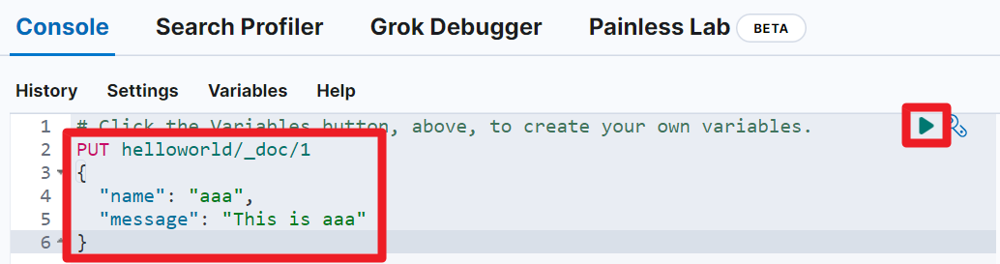
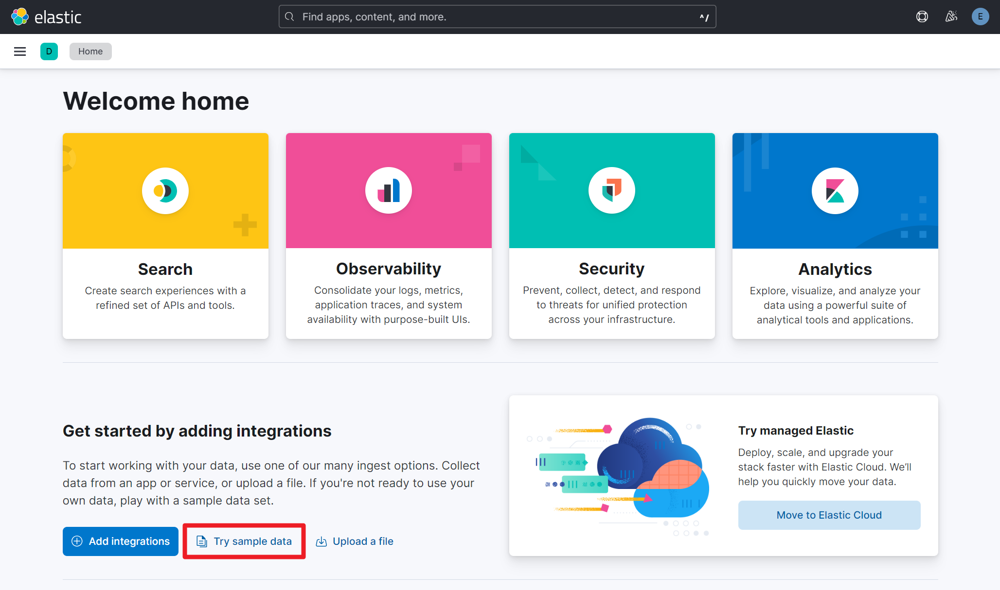
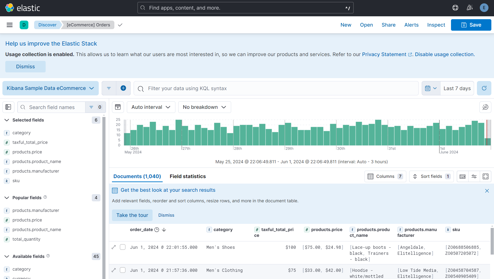

## 세팅 & 예제 데이터 Import

## ELK 스택 설치
Elasticsearch 가 처음이라면 아래의 과정을 통해 설치를 해주세요.<br/>

- [github.com/deviantony/docker-elk](https://github.com/deviantony/docker-elk) 을 clone 
- `.env` 파일 내의 주요 패스워드 들 수정
  - 비밀번호는 8자?이상이어야 에러가 나지 않습니다.

- docker-compose up setup
  - setup-1 exited with code 0 이라는 메시지가 뜨면 정상설치 된 것 입니다.

- docker-compose up -d
- kibana 는 http://localhost:5601 로 접속 가능하며, user, password 는 아래와 같이 입력합니다.
  - user : elastic
  - password : `.env` 파일 내에 입력한 패스워드


<br/>


## 콘솔 접속


<br/>


콘솔은 아래와 같이 사용 가능합니다.<br/>

아래의 코드를 입력합니다. 

```plain
PUT helloworld/_doc/1
{
  "name": "aaa",
  "message": "This is aaa"
}
```

<br/>


그리고 오른쪽 상단의 Run 버튼을 누르거나 Ctrl + Enter 키를 눌러서 명령을 실행합니다.



<br/>


이렇게 하면 index 를 생성해두지 않은 상태라면 새로운 index 가 생성됩니다.<br/>

<br/>


## kibana Sample Data

이번 예제에서는 kibana sample data 를 사용합니다. kibana 콘솔에서는 아래의 메뉴를 통해서 kibana Sample Data 를 사용할 수 있습니다.<br/>

kibana 페이지인 http://localhost:5601 에 접속해서 `Try sample data` 버튼을 클릭해주세요.



<br/>


나타난 페이지에서는 `Other sample data sets` 라는 버튼을 클릭해주세요. 그리고 조금 오래 기다려야 아래와 같은 예제 메뉴들이 나타납니다. 나타난 예제 메뉴 들 중 이번 문서에서는 Sample eCommerce orders 를 사용하기로 결정했습니다.


<br/>


View Data 버튼을 클릭해보면 여러 버튼들이 나타나는데, 원하는 화면들을 모두 들어가서 어떤 기능들이 있는지 확인해봐도 좋습니다.


<br/>


Discover 에는 아래와 같은 화면들이 보여집니다.



<br/>


Dashboard 에는 아래와 같은 화면이 나타납니다.


<br/>

Canvas 에는 아래와 같은 화면들이 나타납니다.


<br/>

Map 에는 아래와 같은 화면들이 나타납니다.


<br/>


## 예제 데이터 확인해보기

이번에는 kibana 콘솔로 진입합니다. (좌측 상단 햄버거 버튼 → Dev Tools 버튼 클릭)<br/>

아래와 같이 `kibana_sample_data_ecommerce` 라는 이름의 인덱스가 추천으로 나타나는 것을 확인할 수 있습니다.<br/>


<br/>


아래의 명령을 수행합니다.

```
GET kibana_sample_data_ecommerce/_search
```

<br/>


출력결과로 굉장히 많은 데이터가 출력됩니다.<br/>

```plain
{
  "took": 1,
  "timed_out": false,
  "_shards": {
    "total": 1,
    "successful": 1,
    "skipped": 0,
    "failed": 0
  },
  "hits": {
    "total": {
      "value": 4675,
      "relation": "eq"
    },
    "max_score": 1,
    
    // ... (생략) ... 내용이 길어서 생략합니다.
    
  }
}
```

<br/>
